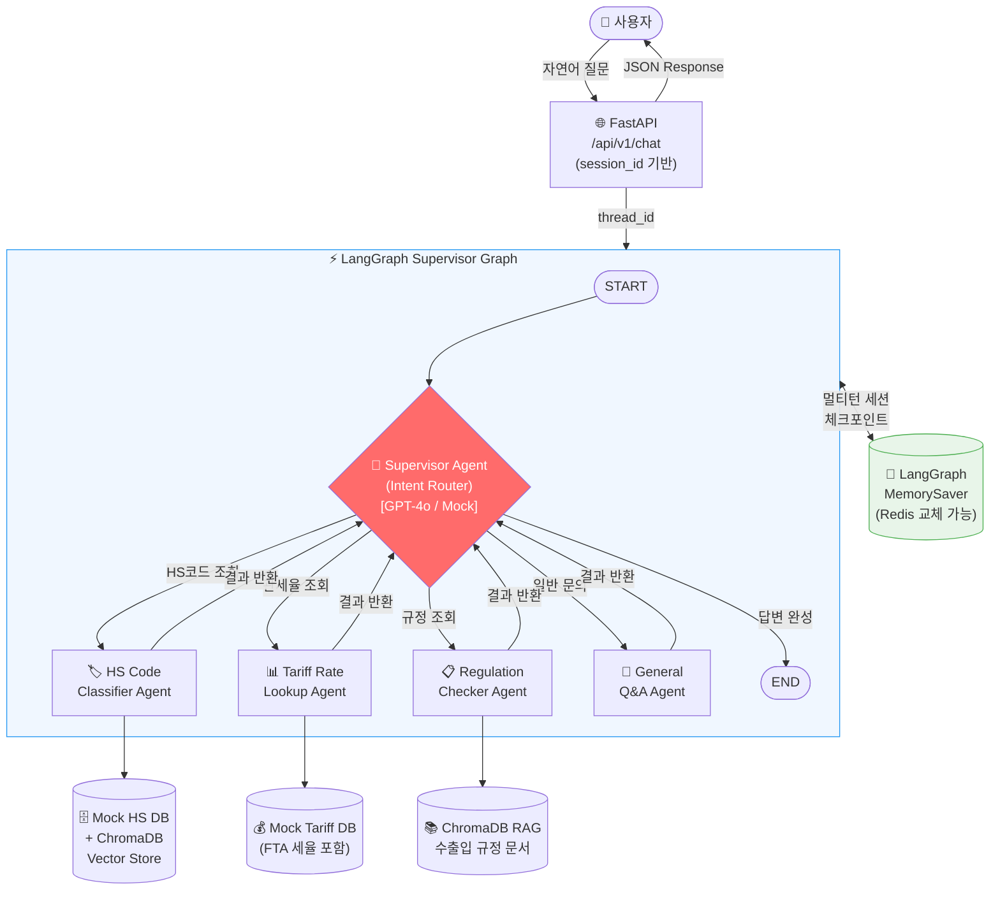
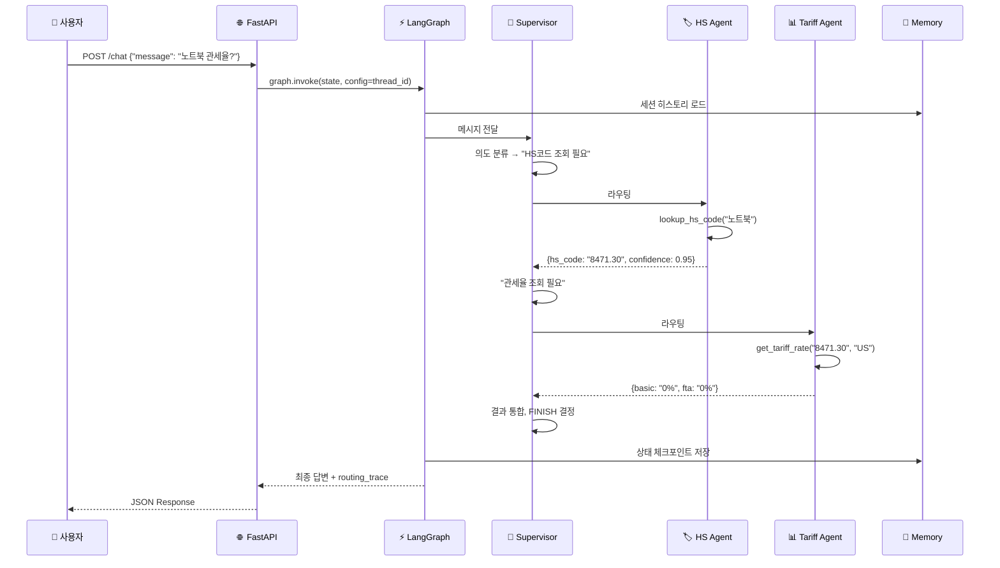

# 🤖 관세청 AI 상담 시스템 — LangGraph Supervisor Multi-Agent Demo

[](https://python.org)
[](https://github.com/langchain-ai/langgraph)
[](https://langchain.com)
[](https://fastapi.tiangolo.com)
[](https://trychroma.com)
[](LICENSE)

> **LangGraph Supervisor 패턴으로 구현된 관세청 AI 멀티에이전트 상담 시스템**  
> HS코드 분류 · 관세율 조회 · 수출입 규정 검색 · 통관 절차 안내를 4개 전문 에이전트가 협력하여 처리합니다.

---

## 📺 데모

```
사용자: "아이폰 케이스 미국에서 수입할 때 관세가 얼마야?"

[Supervisor] → 의도 분류: HS Code 조회 필요
[HS Code Agent] → 품목 분류: 3926.90 (기타 플라스틱 제품)
[Tariff Agent]  → 관세율 조회: 8% (기본세율) / 0% (한-미 FTA 적용)
[Supervisor]    → 결과 통합 및 최종 답변 생성

답변: "아이폰 케이스(HS: 3926.90)의 기본 관세율은 8%이나,
       한-미 FTA 협정세율 적용 시 0%입니다. 다만 개인 $800
       면세 한도를 초과할 경우 신고 의무가 있습니다."
```

> 📸 **스크린샷 / GIF**: [`docs/demo/`](docs/demo/) 폴더 참조  
> 🖥️ Streamlit UI 데모: `make ui` 실행 후 http://localhost:8501

---

## 🏗️ 시스템 아키텍처



---

## ✨ 핵심 기능

| 기능 | 설명 | 구현 방식 |
|------|------|-----------|
| **멀티에이전트 오케스트레이션** | Supervisor가 의도 분류 후 전문 에이전트 동적 라우팅 | LangGraph Supervisor Pattern |
| **멀티턴 세션 관리** | 대화 히스토리 유지, 문맥 기반 답변 | LangGraph Checkpointer |
| **RAG 기반 규정 검색** | 수출입 규정 문서 벡터 검색 | ChromaDB + 임베딩 |
| **HS코드 자동 분류** | 자연어로 품목 설명 → HS Code 추출 | LLM + Vector Similarity |
| **FTA 세율 계산** | 원산지별 협정 세율 자동 적용 | Tool Calling |
| **Structured Output** | Pydantic 모델 기반 에이전트 간 타입 안전 통신 | Pydantic v2 |
| **Observability** | LangSmith 트레이싱, 구조화 로깅 | 상관 ID 추적 |

---

## 🚀 5가지 시니어 차별화 포인트

### 1️⃣ Supervisor 패턴 — "단순 체인이 아닌 동적 오케스트레이션"
```python
# ❌ 주니어: 순차 체인
result = hs_chain.run(query) | tariff_chain.run(result)

# ✅ 시니어: Supervisor가 실행 흐름을 동적으로 결정
class RouterDecision(BaseModel):
    next: Literal["hs_code_agent", "tariff_agent", "regulation_agent", "FINISH"]
    reasoning: str  # 라우팅 근거도 기록 → 디버깅/감사 용이
```
단일 쿼리가 여러 에이전트를 거칠 수도, 하나만 호출할 수도 있습니다.  
Supervisor는 결과를 수집하고 **언제 충분한지 스스로 판단**합니다.

---

### 2️⃣ 멀티턴 컨텍스트 — "세션 메모리 아키텍처 설계"
```python
# thread_id = session_id → 대화별 독립 체크포인트
config = {"configurable": {"thread_id": session_id}}
result = graph.invoke({"messages": [HumanMessage(content=query)]}, config)

# 다음 턴에서도 이전 HS코드, 관세율 결과가 state에 유지됨
# → "그러면 일본산은요?" 같은 후속 질문이 자연스럽게 처리됨
```
`MemorySaver` → `RedisSaver` 교체만으로 **분산 환경 확장** 가능한 설계.

---

### 3️⃣ Pydantic Structured Output — "에이전트 간 타입 안전 통신"
```python
class HSCodeResult(BaseModel):
    hs_code: str = Field(description="6자리 HS Code (예: 8471.30)")
    description: str = Field(description="품목 설명 (한국어)")
    confidence: float = Field(ge=0.0, le=1.0, description="분류 신뢰도")
    alternative_codes: list[str] = Field(default_factory=list)

# LLM이 구조화된 형식으로만 응답 → 파싱 오류 Zero
agent_llm = llm.with_structured_output(HSCodeResult)
```

---

### 4️⃣ Observability-First — "프로덕션 디버깅 설계"
```python
# 모든 에이전트 호출에 상관 ID + 구조화 로그
logger.info("agent_invoked", extra={
    "correlation_id": state["session_id"],
    "agent": "hs_code_agent",
    "intent": state["user_intent"],
    "iteration": state["iteration_count"],
    "langsmith_run_id": run_id,
})
```
LangSmith 트레이싱 + `LANGCHAIN_TRACING_V2=true` 설정만으로  
**전체 에이전트 실행 흐름을 UI로 시각화** 가능합니다.

---

### 5️⃣ Graceful Degradation — "Mock-First, Production-Ready"
```python
# USE_MOCK_LLM=true → 외부 API 없이 완전 동작하는 데모
# USE_MOCK_LLM=false → 실제 OpenAI GPT-4o 사용
class MockSupervisorLLM:
    """API 키 없이도 데모 시연 가능한 결정론적 Mock LLM"""
    def invoke(self, messages) -> RouterDecision:
        return self._rule_based_routing(messages[-1].content)
```
Mock → Real LLM 전환이 **환경변수 하나**로 가능.  
CI/CD 파이프라인에서 비용 없이 통합 테스트 실행.

---

## 🏃 Quick Start

### 1. 환경 설정
```bash
git clone https://github.com/YOUR_USERNAME/langgraph-supervisor-demo.git
cd langgraph-supervisor-demo

python -m venv .venv
.venv\Scripts\activate  # Windows
# source .venv/bin/activate  # Mac/Linux

pip install -r requirements.txt
cp .env.example .env
```

### 2. Mock 모드로 즉시 실행 (API 키 불필요)
```bash
# .env 파일에서 USE_MOCK_LLM=true 확인 후:
make run
# 또는
uvicorn src.api.main:app --reload --port 8000
```

### 3. API 테스트
```bash
curl -X POST http://localhost:8000/api/v1/chat \
  -H "Content-Type: application/json" \
  -d '{
    "session_id": "demo-session-001",
    "message": "노트북 미국에서 수입할 때 관세율이 어떻게 되나요?"
  }'
```

### 4. Streamlit UI
```bash
make ui
# → http://localhost:8501
```

### 5. OpenAI 실제 연동
```bash
# .env 수정
OPENAI_API_KEY=sk-...
USE_MOCK_LLM=false
LANGCHAIN_TRACING_V2=true  # LangSmith 트레이싱 (선택)
LANGCHAIN_API_KEY=ls__...
```

---

## 📡 API 명세

### `POST /api/v1/chat` — 대화형 질의
```json
// Request
{
  "session_id": "user-abc-123",
  "message": "아이폰 케이스 수입 관세율 알려줘"
}

// Response
{
  "session_id": "user-abc-123",
  "answer": "아이폰 케이스(HS: 3926.90)의 기본 관세율은 8%이며...",
  "agents_used": ["hs_code_agent", "tariff_agent"],
  "routing_trace": [
    {"step": 1, "agent": "supervisor", "decision": "hs_code_agent", "reasoning": "품목 HS코드 확인 필요"},
    {"step": 2, "agent": "hs_code_agent", "result": {"hs_code": "3926.90", "confidence": 0.92}},
    {"step": 3, "agent": "supervisor", "decision": "tariff_agent", "reasoning": "HS코드 확인 완료, 관세율 조회 필요"},
    {"step": 4, "agent": "tariff_agent", "result": {"basic_rate": "8%", "fta_rate": "0%"}},
    {"step": 5, "agent": "supervisor", "decision": "FINISH", "reasoning": "모든 정보 수집 완료"}
  ],
  "turn_count": 1
}
```

### `GET /api/v1/sessions/{session_id}` — 세션 히스토리 조회
```json
{
  "session_id": "user-abc-123",
  "messages": [...],
  "turn_count": 3
}
```

### `DELETE /api/v1/sessions/{session_id}` — 세션 초기화
```json
{ "status": "cleared" }
```

---

## 📁 프로젝트 구조

```
langgraph-supervisor-demo/
├── README.md                    # ← 지금 읽고 계신 파일
├── requirements.txt
├── .env.example
├── docker-compose.yml
├── Makefile
│
├── src/
│   ├── config.py                # 환경변수 기반 설정 (Pydantic Settings)
│   ├── state/
│   │   └── customs_state.py     # ★ LangGraph 상태 정의 (TypedDict + add_messages)
│   ├── agents/
│   │   ├── supervisor.py        # ★ Supervisor: 의도 분류 + 동적 라우팅
│   │   ├── hs_code_agent.py     # HS Code 분류 에이전트
│   │   ├── tariff_agent.py      # 관세율 조회 에이전트
│   │   └── regulation_agent.py  # 수출입 규정 검색 에이전트 (RAG)
│   ├── tools/
│   │   ├── tariff_tools.py      # Mock 관세 DB 조회 툴
│   │   └── rag_tools.py         # ChromaDB 벡터 검색 툴
│   ├── memory/
│   │   └── session_manager.py   # 세션 관리 (MemorySaver 래퍼)
│   ├── graph/
│   │   └── workflow.py          # ★ LangGraph StateGraph 조립
│   ├── api/
│   │   ├── main.py              # FastAPI 앱 진입점
│   │   ├── schemas.py           # Request/Response Pydantic 모델
│   │   └── routers/chat.py      # 채팅 라우터
│   └── ui/
│       └── streamlit_app.py     # Streamlit 데모 UI
│
├── data/
│   ├── mock_tariff_data.json    # Mock HS코드 & 관세율 데이터
│   └── mock_regulations.json   # Mock 수출입 규정 데이터
│
└── tests/
    ├── test_agents.py           # 에이전트 단위 테스트
    └── test_workflow.py         # 그래프 통합 테스트
```

---

## 🛠️ 기술 스택

| 계층 | 기술 | 버전 | 용도 |
|------|------|------|------|
| **AI Orchestration** | LangGraph | 0.2.x | Supervisor 멀티에이전트 그래프 |
| **LLM Framework** | LangChain | 0.3.x | 에이전트, 툴, 프롬프트 관리 |
| **LLM** | OpenAI GPT-4o | latest | 의도 분류, 에이전트 추론 |
| **Vector DB** | ChromaDB | 0.5.x | RAG 문서 임베딩 검색 |
| **API** | FastAPI | 0.115.x | RESTful 채팅 API |
| **UI** | Streamlit | 1.40.x | 데모용 채팅 인터페이스 |
| **Observability** | LangSmith | - | 에이전트 트레이싱 & 디버깅 |
| **Validation** | Pydantic | v2 | 구조화 출력, 설정 관리 |
| **Runtime** | Python | 3.11+ | - |

---

## 🔄 에이전트 실행 흐름 (시퀀스)



---

## 🧪 테스트 실행

```bash
# 전체 테스트 (Mock 모드, API 키 불필요)
pytest tests/ -v

# 특정 에이전트 테스트
pytest tests/test_agents.py::test_hs_code_agent -v

# 멀티턴 통합 테스트
pytest tests/test_workflow.py::test_multi_turn_conversation -v

# 커버리지 리포트
pytest tests/ --cov=src --cov-report=html
```

---

## 🐳 Docker 실행

```bash
docker-compose up -d
# API: http://localhost:8000
# UI:  http://localhost:8501
# API Docs: http://localhost:8000/docs
```

---

## 🗺️ 로드맵

- [x] Supervisor 멀티에이전트 그래프
- [x] 멀티턴 세션 관리 (LangGraph Checkpointer)
- [x] ChromaDB RAG 통합
- [x] FastAPI REST 엔드포인트
- [x] Streamlit 데모 UI
- [x] Mock 모드 (API 키 없이 전체 동작)
- [ ] PGVector 마이그레이션 (프로덕션)
- [ ] Redis 기반 분산 세션 (RedisSaver)
- [ ] Spring AI MCP 서버 연동 ([langgraph-springai-demo](../langgraph-springai-demo))
- [ ] n8n 워크플로우 트리거 통합

---

## 📄 라이선스

MIT License — 자유롭게 사용, 수정, 배포하세요.

---

> **관련 프로젝트** (동일 관세 도메인 · 3-part 포트폴리오)  
> → [`customs-rag-springai`](https://github.com/YOUR_USERNAME/customs-rag-springai) — Spring AI + PGVector RAG  
> → [`customs-chatbot-vue3`](https://github.com/YOUR_USERNAME/customs-chatbot-vue3) — Vue3 프론트엔드
